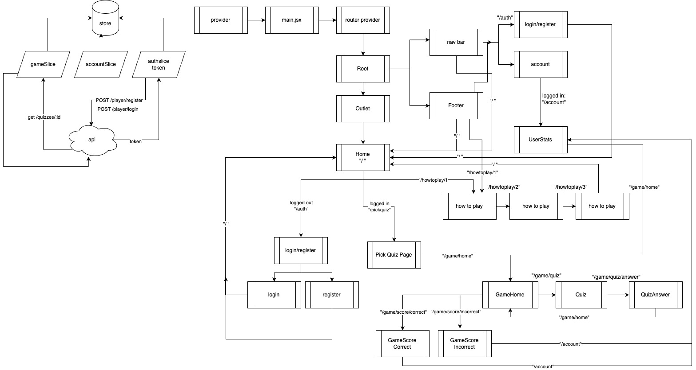
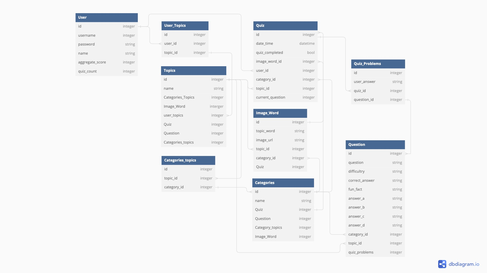
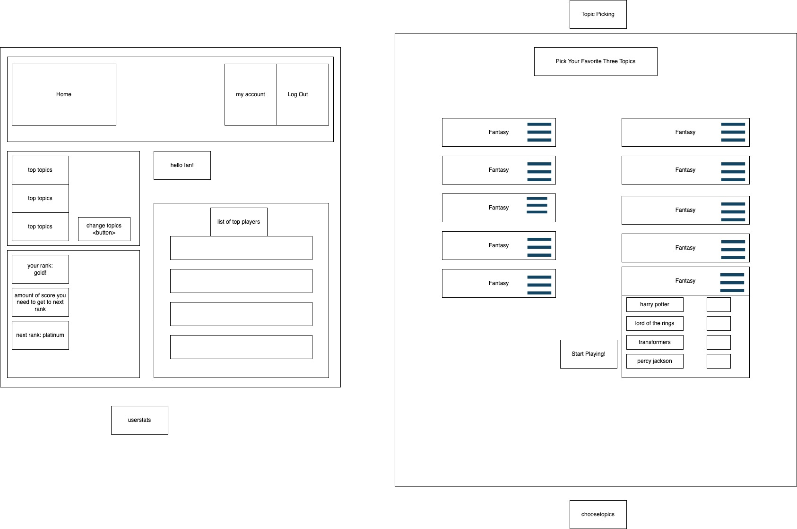

# Full-stack Template

This template provides a fully functional CRUD app. Once a user has successfully registered for an account and logged in, they can see their existing tasks, create new tasks, update existing tasks, and delete tasks.

## Getting Started

1. Click "Use This Template" and "Create a new repository."
2. Clone down your repo and run `npm install`.
3. Create a `.env` file according to the provided `example.env`.
4. Apply the initial Prisma migration and generate the client.\
   `npx prisma migrate reset`
5. Start developing!\
   `npm run dev`

## Architecture

### Backend

The backend consists of an [Express](https://expressjs.com/) server with a SQLite database and [Prisma](https://www.prisma.io/) as the ORM. The entrypoint is `src/server/index.js`.

API routes can be found in `src/server/api/`.

Authentication is handled with [JWT](https://github.com/auth0/node-jsonwebtoken). User passwords are hashed with [bcrypt](https://github.com/kelektiv/node.bcrypt.js).


<details>
<summary>Expand to see DBML</summary>

```dbml
Table User {
  id        Serial  [pk]
  username  String
  password  String
}

Table Task {
  id          Serial  [pk]
  description String
  done        Boolean
  userId      Int
}

Ref: User.id < Task.userId
```

</details>

### Frontend

The frontend is a [React](https://react.dev/) app created with [Vite](https://vitejs.dev/). Vite middleware is used in development, but the frontend should be built for production.

Routing is handled with [React Router](https://reactrouter.com/en/main). The router is defined in `src/client/main.jsx`.

Application state is managed with [Redux Toolkit](https://redux-toolkit.js.org/). The store is defined in `src/client/store/index.js`. Additional slices should be defined separately in `src/client/features`.

[RTK Query](https://redux-toolkit.js.org/rtk-query/overview) is used to handle data fetching. The central API slice is defined in `src/client/store/api.js` and is intended to stay empty. Additional endpoints should be injected separately in `src/client/features`.

[Less](https://lesscss.org/) is used as the CSS preprocessor.

# Capstone Project

Our project is a daily quiz game designed to blend learning with entertainment, transforming education into an engaging and fun experience. At its core, the game invites users to select from a wide array of topics—from Harry Potter to Beethoven, to Hockey—and tailors daily quizzes to these preferences. It features a unique picture-revealing quiz format, where images are gradually unblurred and word answers unveiled letter by letter, all based on the player's correct responses to a series of questions. This method not only boosts recall and learning but also introduces an element of mystery and discovery.

Players are motivated to improve through a dynamic system of scoring and ranking, designed to foster growth and reward progress with increasingly challenging content. Moreover, the game enriches the learning experience by providing insightful fun facts with each answered question.

Our goal is to create a platform where learning is seamlessly integrated with gaming elements, encouraging users to make exploring new knowledge areas a daily habit. We aim to foster a community of learners who revel in discovery and self-improvement, transforming each quiz from a mere test of knowledge into an opportunity to broaden one’s horizons.








